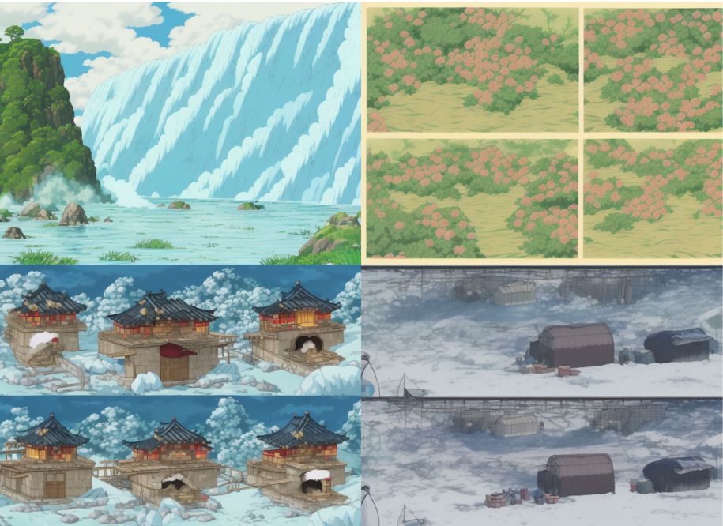
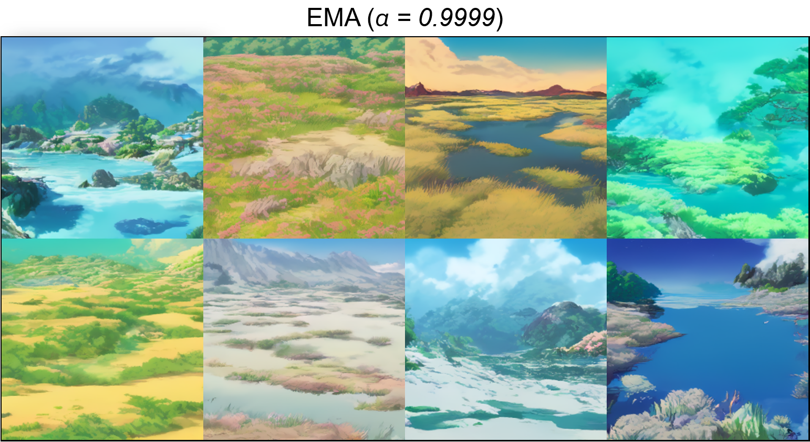
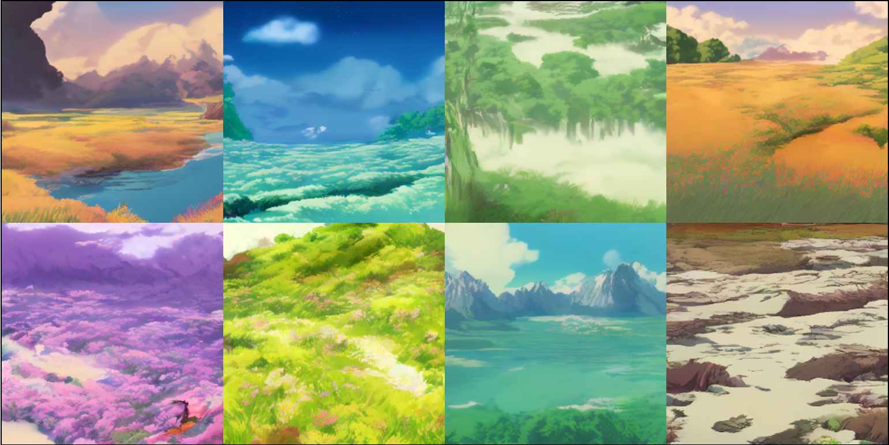

# Learning to Paint with Diffusion Model
**Diffusion models** are generative models that create images by gradually refining random noise into detailed and coherent visuals.
For generating natural landscape scenes in the **Studio Ghibli style**, diffusion models learn from a collection of Ghibli-inspired artwork, capturing their distinctive soft color palettes, watercolor textures, and atmospheric lighting.
This enables the model to synthesize new images that evoke the warm, nostalgic, and hand-painted feel characteristic of Ghibli films, blending fantasy with nature in a harmonious way.
<p align="center">
    
</p>

## Data
The project leverages a pre-trained [**_Diffuser_**](https://github.com/huggingface/diffusers?tab=readme-ov-file) model as its foundation to create natural landscape imagery in the enchanting and iconic style of Studio Ghibli.
It produces high-resolution visuals at _704×512_ pixels, capturing diverse sceneries—from forests, beaches, mountains, and deserts to dynamic atmospheres shaped by varying weather conditions such as bright sunshine, gentle snowfall, and misty fog.
<p align="center">
    
</p>

The training dataset consists of _2400 images_, generated using the following configuration:
```python
MODEL_ID = "nitrosocke/Ghibli-Diffusion"
CFG_SCALE = 7
WIDTH = 704
HEIGHT = 512
SAMPLER = "Euler a"
```

## Training
The model was trained from scratch for _132k_ training steps using [**_OpenAI's improved-diffusion_**](https://github.com/openai/improved-diffusion/tree/main). This training process allowed the diffusion model to learn directly from the dataset, enabling it to capture the distinctive artistic style and diverse natural landscapes reminiscent of Studio Ghibli, thereby enhancing its capability to generate high-quality images in this specific style. The trained model in this project produces images at a resolution of _256x256_ pixels.
Configuration for training:
```python
MODEL_FLAGS="--image_size 256 --num_channels 128 --num_res_blocks 2 --num_heads 1 --learn_sigma True --use_scale_shift_norm False --attention_resolutions 16"
DIFFUSION_FLAGS="--diffusion_steps 1000 --noise_schedule linear --rescale_learned_sigmas False --rescale_timesteps False --use_scale_shift_norm False"
TRAIN_FLAGS="--lr 2e-5 --batch_size 4 --lr_anneal_steps 132000"
```

## Examples
In my experiments, I tried fine-tuning the model with landscape scenes that included humans. However, the generated images of people were unrealistic and somewhat distorted. This was mainly due to the poor quality and insufficient diversity of the training data related to human figures. As a result, I decided to focus the training exclusively on natural landscapes to ensure higher quality and more coherent image generation.
<p style="margin:0; padding:0;">
  
  
</p>
